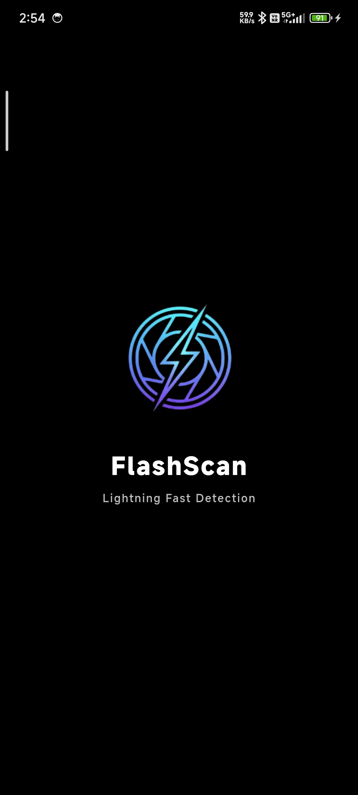
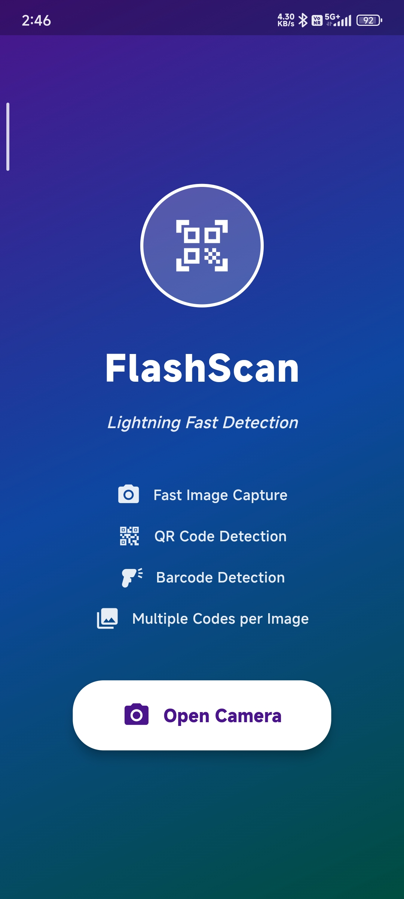
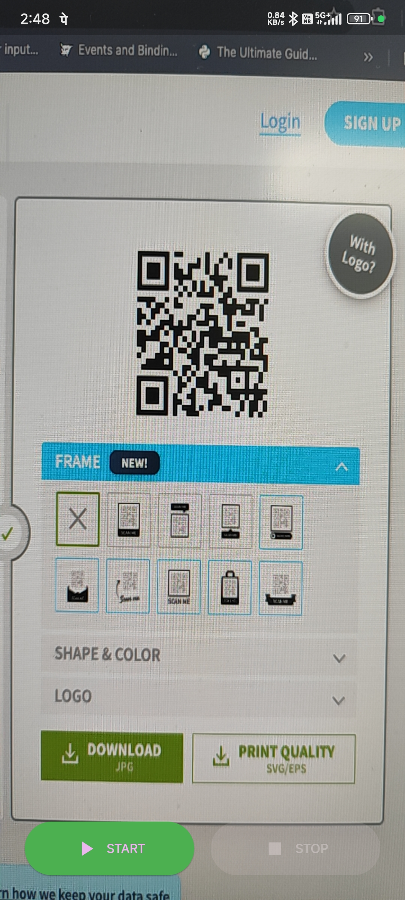
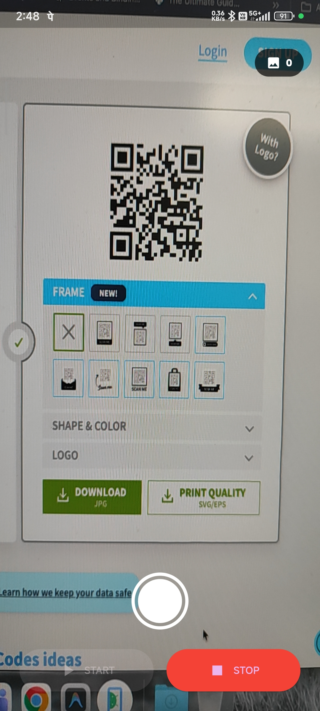
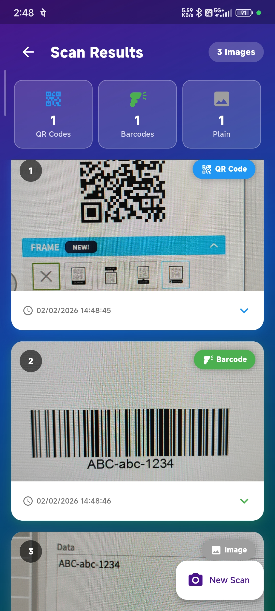

# FlashScan

Ultra-fast barcode and QR code scanner with batch processing capabilities.

## Screenshots

## Screenshots

  
  &nbsp;&nbsp;&nbsp;
  

 

  
  &nbsp;&nbsp;&nbsp;
  
  &nbsp;&nbsp;&nbsp;
  

## Features

- **Fast Batch Scanning**: Capture multiple images rapidly and scan them all at once
- **Multi-Code Detection**: Detects multiple barcodes/QR codes in a single image
- **Tap-to-Focus**: Tap anywhere on camera preview to focus (with visual indicator)
- **High Resolution**: Ultra-high quality image capture for better detection
- **Detailed Results**: View decoded values, timestamps, and code counts

## How to Use

### 1. Launch the App
- Open **Flash Scan** on your Android device
- Tap **"Open Camera"** button

### 2. Capture Images
- Tap **START** to begin capturing
- **Tap the shutter button** to capture each image
- Capture as many images as needed
- Tap **STOP** when finished

### 3. Camera Controls
- **Tap-to-Focus**: Tap anywhere on screen to focus at that point
- **Image Counter**: Top-right shows number of captured images

### 4. View Results
- After tapping STOP, scanning begins automatically
- Wait for processing to complete
- View all detected codes with:
  - Decoded values
  - Date and time
  - QR code and barcode counts
- Tap any image card to expand and see full details

## Installation

1. Download `app-release.apk`
2. Enable "Install from Unknown Sources" in Android settings
3. Install the APK
4. Grant camera permissions when prompted

## Requirements

- Android 5.0 (Lollipop) or higher
- Camera permission

## Technical Details

- **Built with**: Flutter
- **Barcode Detection**: Google ML Kit
- **Supported Formats**: All standard barcode and QR code formats
- **Resolution**: Ultra-high quality capture

## Tips for Best Results

- Ensure good lighting
- Hold camera steady while capturing
- Use tap-to-focus for better clarity
- Capture multiple angles if codes are hard to read
